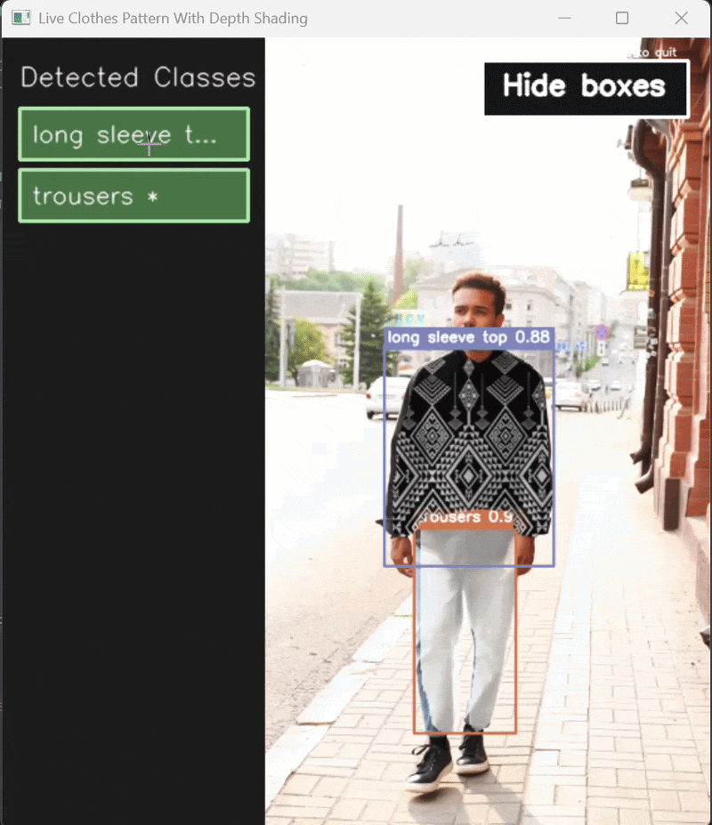

# Clothes Segmentation

Depth-aware clothes segmentation and virtual fabric overlay using YOLO, OpenCV, and Depth Anything V2.

This project trains a custom clothing segmentation model, runs image and video segmentation, and supports live class-specific clothes texture swapping while preserving masks, folds, shadows, and depth cues.

## Demo


Pexels video by Olia Danilevich
## Features

- YOLO-based clothing segmentation
- Image segmentation viewer with fabric overlay
- Live video segmentation with mask overlays
- Live depth estimation with Depth Anything V2
- Live clothes swap workflow with:
  - temporal mask smoothing
  - depth-aware shading
  - dynamic detected-class sidebar
  - click-to-assign fabric images from your computer
  - show/hide boxes and labels toggle

## Repository Layout

```text
.
|-- assets/
|   |-- demo/
|   `-- patterns/
|-- configs/
|-- docs/
|-- local_only/
`-- src/
```

- `src/`: project scripts
- `configs/`: reusable configuration files
- `assets/patterns/`: public sample pattern images
- `assets/demo/`: public sample demo media
- `local_only/`: non-public local assets such as datasets, weights, generated runs, caches, and cloned third-party repos

## Setup

1. Create and activate a Python environment.
2. Install dependencies:

```bash
pip install -r requirements.txt
```

3. Put local-only resources in the expected locations:

- Trained segmentation weights: `local_only/models/clothes_seg_best.pt`
- Base YOLO segmentation model for training: `local_only/models/yolo26n-seg.pt`
- Dataset folders: `local_only/dataset/train`, `local_only/dataset/valid`, `local_only/dataset/test`

Depth Anything V2 is cloned automatically into `local_only/external/Depth-Anything-V2` the first time a depth-based script is run.

## Run

### Train the segmentation model

```bash
python src/train.py
```

### View image segmentation

```bash
python src/view_segmentation_image.py
```

### Run live video segmentation

```bash
python src/live_video_segmentation.py
```

### Run live depth estimation

```bash
python src/live_depth_anything_v2.py
```

### Run live clothes swap segmentation

```bash
python src/live_clothes_swap_segmentation.py
```

## Notes

- The full dataset, trained weights, generated runs, and local caches are intentionally excluded from GitHub.
- Public sample media is included only to make the repo easier to understand and demo.
- Most scripts use repo-relative paths so they can be moved across machines more easily.
